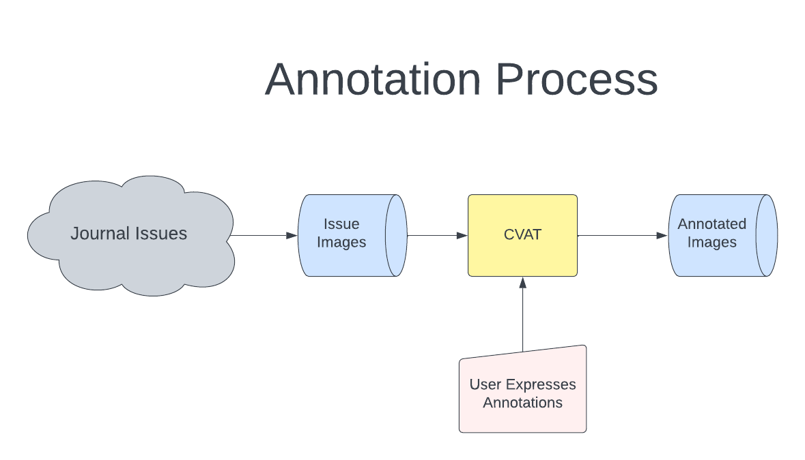
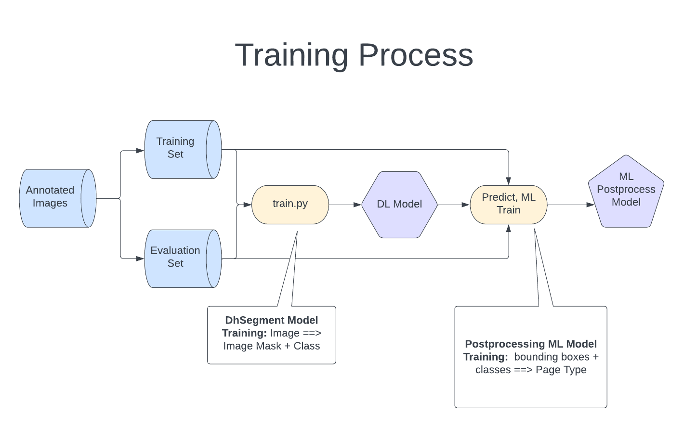
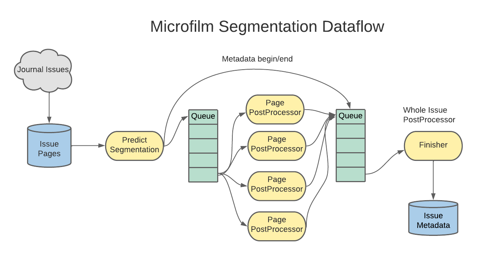

Ufilm Segment
=============

**License:** Apache-2.0

## Introduction

This is a proof of concept for [Internet Archive](https://archive.org) of text segmentation/extraction for microfilm archives. Like many libraries, the Archive has thousands of journals and magazines on microfilm which has been digitized. The issues are organized only as images with some metadata. What is missing is a clickable table of contents to show specific articles. This project was able to show that a U-shaped deep learning neural network is able to be trained to extract article titles, authors and bibliography to make a table of contents. Accuracy was around 95% for single journal training.

The U-shaped neural network is from the [dhSegment](https://github.com/tralfamadude/dhSegment) project which is derived from the wonderful work done by the Digital Humanities Laboratory [dhSegment](https://github.com/dhlab-epfl/dhSegment) project at [EPFL](http://dhlab.epfl.ch).

## Image Annotation
For image annotation, I used CVAT from the OpenVino project from Intel. There is no direct tie-in with CVAT to this code. A different annotation system could be used as long as it saves files in the same format.

A U-shaped netowrk is a pixel to pixel mapping where an original imaage (the X of the neural network) is mapped to the same size image (the Y) with colors representing the segmentation class. A csv file is used to name the classes (config/annotation_names.csv) which correspond to colors from a predefined list. 

## Training Process
The images from the microfilm journal are paired with annotated image masks as training data. They are split into training and evaluations sets which are used to train the dhSegment model. Then a secondary classic ML model (decision tree) is trained to take the output of the dhSegment model and predict/classify which kind of page it is. For example, the page might be the table of contents or article start or bibliography. This page classification helps postprocessing take appropriate actions.

## Distributed Computing
This project uses [Ray](https://github.com/ray-project/ray) to enable the GPU to be fully used when processing a stream of images from microfilm journal issues. The reason this is important is that the neural network running on a GPU can process an image much faster than the preprocessing and postprocessing on the CPU when only one core is used by the CPU. Ray is used to create parallelism so that the CPU does not make the GPU idle. Ray queues are used for flow control. One journal issue is processed at a time as an ordered list of images, one image per page. The images are put into a queue and multiple instances of the preprocessing step pop images off the queue and put the result to the GPU for inference. After the GPU, the results of inference are pushed on to a finishing queue for postprocessing. The postprocesing does not commence until all the images from a journal issue are processed by the GPU. This enables the postprocessing to see all the inferences for the issue at once and that means it is able to analyze the content in a holistic way. This enables context to be used to drop misclassifications, etc. 

## Results
The output is a json that describes the articles found in a journal. 

## Conclusion
The tests on one journal showed that accuracy of extraction reached 95%. There are thousands of journals in the collection, so next step would be to bulk-annotate perhaps a hundred journal examples and then retrain and test for accuracy on journals that were not in the training set. Currently there is no funding for this so the project remains a proof of concept. 

My favorite part of this project is the ML Ops part where Ray is used for parallelism. I am making this available in case the Ray design patterns used here can be helpful to others and as an example of U-shaped neural network text extraction, and whole-issue journal processing.

